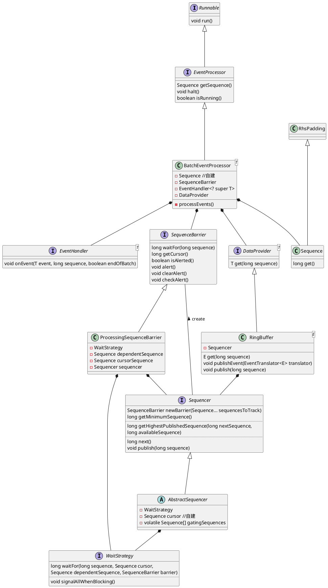

# Disruptor

## demo

```java
 private void initDisruptor() {
    // 必须是 2^n
    int bufferSize = 1024 << 2;
    // 多生产者，生产、消费 CacheEvent，队列满等待
    disruptor = new Disruptor<>(CacheEvent::new, bufferSize, Executors.defaultThreadFactory(),
            ProducerType.MULTI, new BlockingWaitStrategy());
    // 使用 doRefreshCache 消费 cacheEvent
    disruptor.handleEventsWith(this::doRefreshCache);
    // 加上默认的异常处理，因为 Disruptor 自带的会抛出 RunTimeException 杀死消费者线程
    disruptor.setDefaultExceptionHandler(new ExceptionHandler<CacheEvent>() {
        @Override
        public void handleEventException(Throwable ex, long sequence, CacheEvent event) {
            log.error("sequence " + sequence + " error!", ex);
        }

        @Override
        public void handleOnStartException(Throwable ex) {
            log.error("Exception during onStart()", ex);
        }

        @Override
        public void handleOnShutdownException(Throwable ex) {
            log.error("Exception during onShutdown()", ex);
        }
    });
    ringBuffer = disruptor.start();
}
```


## 解读

### start()
```java
public RingBuffer<T> start()
{
    checkOnlyStartedOnce();
    // handleEventsWith(...) 添加到 consumerRepository
    for (final ConsumerInfo consumerInfo : consumerRepository)
    {
        // 开启消费者线程，从 executor 里获得线程
        // Demo 里指定了 ThreadFactory，默认通过其创建 BasicExecutor
        // 而其 execute() 是创建一个新线程
        consumerInfo.start(executor);
    }

    return ringBuffer;
}
```

### handleEventsWith(handlers)

```java
public final EventHandlerGroup<T> handleEventsWith(final EventHandler<? super T>... handlers)
{
    return createEventProcessors(new Sequence[0], handlers);
}

EventHandlerGroup<T> createEventProcessors(
        final Sequence[] barrierSequences,
        final EventHandler<? super T>[] eventHandlers)
{
    checkNotStarted();

    final Sequence[] processorSequences = new Sequence[eventHandlers.length];
    // 创建 SequenceBarrier：跟踪 publisher 的游标
    final SequenceBarrier barrier = ringBuffer.newBarrier(barrierSequences);

    for (int i = 0, eventHandlersLength = eventHandlers.length; i < eventHandlersLength; i++)
    {
        final EventHandler<? super T> eventHandler = eventHandlers[i];

        // 核心接口 EventProcessor 实现类
        final BatchEventProcessor<T> batchEventProcessor =
            new BatchEventProcessor<>(ringBuffer, barrier, eventHandler);

        if (exceptionHandler != null)
        {
            batchEventProcessor.setExceptionHandler(exceptionHandler);
        }

        // 消费者加到 consumerRepository 中
        consumerRepository.add(batchEventProcessor, eventHandler, barrier);
        processorSequences[i] = batchEventProcessor.getSequence();
    }

    updateGatingSequencesForNextInChain(barrierSequences, processorSequences);

    return new EventHandlerGroup<>(this, consumerRepository, processorSequences);
}
```



### 消费者核心代码

```java
private void processEvents() {
    T event = null;
    long nextSequence = sequence.get() + 1L;

    while (true) {
    
        // 没有有效的 sequence 会阻塞线程
        final long availableSequence = sequenceBarrier.waitFor(nextSequence);
        if (batchStartAware != null)
        {
            batchStartAware.onBatchStart(availableSequence - nextSequence + 1);
        }
        
        // 不断消费到 availableSequence
        while (nextSequence <= availableSequence)
        {
            event = dataProvider.get(nextSequence);
            eventHandler.onEvent(event, nextSequence, nextSequence == availableSequence);
            nextSequence++;
        }

        sequence.set(availableSequence);
    }
}
```

这里选择 `BlockingWaitStrategy` 作为 `WaitStrategy` 的实现看 `waitFor()` 的实现。

```java
public long waitFor(long sequence, Sequence cursorSequence, Sequence dependentSequence, SequenceBarrier barrier)
        throws AlertException, InterruptedException
{
    long availableSequence;
    if (cursorSequence.get() < sequence)
    {
        // AQS Lock
        lock.lock();
        try
        {
            // 假如现有生产者的序号没有跟上消费序号，就 await
            // signal 在生产者实现
            while (cursorSequence.get() < sequence)
            {
                barrier.checkAlert();
                // Lock's Condition await here
                processorNotifyCondition.await();
            }
        }
        finally
        {
            lock.unlock();
        }
    }

    // dependentSequence 目前还不明白 :(
    while ((availableSequence = dependentSequence.get()) < sequence)
    {
        barrier.checkAlert();
        ThreadHints.onSpinWait();
    }

    return availableSequence;
}
```

### 生产者

```java
public void publishEvent(EventTranslator<E> translator)
{
    // 取号
    final long sequence = sequencer.next();
    translateAndPublish(translator, sequence);
}

private void translateAndPublish(EventTranslator<E> translator, long sequence)
{
    try
    {
        // 设置数据属性
        translator.translateTo(get(sequence), sequence);
    }
    finally
    {
        // 发布
        sequencer.publish(sequence);
    }
}

// SingleProducerSequencer 
public void publish(long sequence)
{
    cursor.set(sequence);
    // 唤醒消费者如果消费者在阻塞
    waitStrategy.signalAllWhenBlocking();
}
```

- Disruptor 类不多
- 伪共享的去除
- RingBuffer
- Lock & Condition
- Wait & Notify