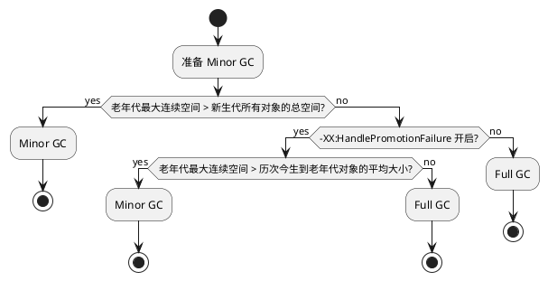

# 深入理接 Java 虚拟机

## Java 内存区域 & 内存溢出异常

### 运行时数据区域

#### 程序计数器

1. 较小的内存空间；
2. 当前线程执行的字节码的行号指示器；
3. 字节码解释器通过修改这个的值获取下一条执行的字节码指令；
4. 每个线程一个独立的。

#### Java 虚拟机栈

1. 线程私有；
2. 每个方法执行，`VM Stack` 就会创建一个**栈帧**(`Stack Frame`)；
    - 局部变量表：相当于 `C++` 中的栈。下面数据以 `slot` 的形式存放。**所需的内存空间再编译期确定完成**。
        - 基本数据类型
        - 对象引用
        - returnAddress
    - 操作数栈
    - 动态连接
    - 方法出口

#### 本地方法栈

#### Java 堆

**几乎所有**的对象实例以及数组都在堆上分配。

`Java 堆`中分出多个线程私有的**分配缓冲区**(`Thread Local Allocation Buffer, TLAB`)提升对象分配的效率，更好的回收内存，更快的分配内存。

#### 方法区

存储被虚拟机加载的：
- 类型信息
- 常量
- 静态变量
- JIT 编译后的代码缓存

是堆的一个逻辑部分。**永久代**实现方法区，能像管理 `Java 堆` 一样管理方法区。现在是在本地内存中实现的**元空间**。

内存回收：
- 常量池的回收
- 类型的卸载

#### 运行时常量池

**是方法区的一部分**。存放 **编译期生成的字面量** 和 **符号引用** 以及 **翻译过来的直接引用**。可以在运行期间放入。

#### 直接内存

`NIO` 中 `DirectByteBuffer`。

### 对象的创建

当遇到 `new` 时。

- 检查指令的参数是否在常量池中定位到一个**类的符号引用**；
- 检查**符号引用**是否被加载，解析，初始化。如果没有，则进行前面操作；
- 为新生对象分配内存：
    - 方法：
        - 指针碰撞：**规整**内存。一侧放分配的，另一侧空的。
        - 空闲列表：**不规整**内存。
        > **规整**由是否带有 `Compact` 功能来决定。
    - 分配时保证线程安全：
        - 同步：`CAS`
        - 每个线程在 `Java 堆` 中先分配一小块内存，**TLAB**，需要分配内存现在 `TLAB` 中分配。当 `TLAB` **用完了才会分配新的缓存区时同步锁定**。
- 新分配的内存初始化 `0`；
- 对象必要的设置**对象头中相关信息**；
- 调用**构造函数** `<init>()`

### 对象内存布局

- 对象头：`Mark Word`
    - 对象自身运行时的数据
        - HashCode
        - GC 年龄分代
        - 锁状态
        - 线程持有的锁
        - 偏向线程 `ID`
        - 偏向时间戳
    - 类型指针：确定这个对象时哪个类型的实例
- 实例数据：**相同宽度**的字段总是被**分配到一起**存放，父类分配在子类之前(`+XX:FieldsAllocationStyle`)。子类较窄的允许插入到父类间隙中(`+XX:CompactFields`)。
- 对齐填充：8字节整数倍。

### 对象的访问定位

- 句柄：开出一块内存：句柄池，句柄包括：到对象**实例数据**的指针，到对象**类型数据**的指针。`reference` 存放的时对象的句柄地址。
- 直接指针：`reference`存放的时对象的直接地址。需要考**虑如何放置访问类型数据的相关信息**。

---

## 垃圾收集器 & 内存回收策略

### 可达性分析

`GC Roots` 作为起始节点集，根据引用关系向下搜索。

- **虚拟机栈**中引用的对象；
- **方法区中静态属性**引用的对象；
- **方法区中常量**引用的对象；
- **本地方法栈中 JNI**引用的对象；
- **虚拟机内部的引用**:
    - `Class 对象`
    - 常驻的异常对象
    - 系统类加载器
- **被同步锁持有**的对象；
- 反映虚拟机内部情况的 `JMXBean`、`本地代码缓存`、`JVMTI中注册的回调`。

### 引用类型

- 强：引用复制 `xxx = new XXX()`
- 软(SoftReference)：**还有用，但非必须**。系统**将要发生内存溢出异常前**，**列进回收范围**之中进行**第二次回收**。
- 弱(WeakReference)：**非必须对象**。只能生存到下一次垃圾收集发生为止。无论内存是否够用。
- 虚(PhantomReference)：不会对其生存时间构成影响，也无法通过其来获取对象的实例。目的：在对象被回收前收到一个系统通知。

### finalize() 自救

`finalize` 将要被弃用，不写了。

### 回收方法区

收集：
- 废弃的常量；
- 不再使用的类型。

满足条件：
- 所有实例都已经被回收；
- 加载该类的类加载器已经被回收；
- 对应的 `Class` 对象没有在任何地方被引用，无法在任何地方通过反射访问该类的方法。

### 垃圾回收算法

#### 分代回收

基于：
- 弱分代假说：绝大多数对象朝生夕灭；
- 强分代假说：熬过越多次越难以消亡。
> **新生代**、**老年代**。
- 跨代引用假说：跨代引用占极少数
> 对象不是孤立的，可能存在跨代引用，新生代的对象被老年代引用，进而进行 `Minor GC` 新生代回收时需要遍历老年代。

> 只需在新生代上建立一个全局的数据结构（**记忆集**），这个结构把老年代分成了若干块，**标记出老年代的哪一块内存会存在跨代引用**。

GC 种类：

- Minor GC：只收集**新生代**；
- Major GC：只收集**老年代**（`CMS` 独有）；
- Mixed GC：**整个新生代**以及**部分老年代**（`G1` 独有）；
- Full GC：整个 `Java 堆` 和 `方法区`。

GC 算法：

- Mark-Sweep：
    - 1. 标记所有需要回收的对象；
    - 2. 同一对标记的进行回收。
    > 执行效率不稳定，大量对象慢；产生空间碎片会引起下一次垃圾回收。
- Mark-Copy：为了解决上面大量对象效率低：
    - 半区复制：将内存划分为两个大小相同的块。每次只是用其中一块。将存活对象复制到另一块，清除原来的那块。
    - Appel 式回收：**新生代**划分为一个较大的 `Eden` 和两个较小的 `Survivor`。
        - `Eden`、一个`Survivor` 一次性复制到另一个 `Survivor`。清理原来的两个区。 `Eden` : 一个 `Survivor` 为 8 : 1。
        - 当 `Survivor` 不足以容纳一次 `Minor GC`时，有一个**逃生门**设计，即**另一个内存区域**（老年代）进行**分配担保**。即无法容纳的对象直接进入老年代了。
- Mark-Compact：当存活率较高时，上面的算法就会进行较多的复制，效率会降低。如果不想浪费 50% 的空间，就需要额外的空间进行担保，`Mark-Copy` **不适合老年代**。
    - 类似于 `Mark-Sweep`，但是**不是清除**而是**向空间的另一端移动**，然后直接清理掉边界以外的内存。
    - `M-Compact` vs. `M-Sweep`：
        - 移动需要更新这些对象的引用，**负担大**；必须要 `Stop The World`。
        > 回收时复杂
        - 不移动，需要考虑空间碎片，要解决只能**依赖更复杂的内存分配器和访问器**：如`分区空闲分配链表`。
        > 分配时复杂

        > 但是整个吞吐量（`GC` 的用户程序）来说，**移动更划算**。
    > 或者多数时间使用 `M-Sweep`，容忍内存碎片。受不了了来一下 `M-Compact`。

### HotSpot 算法细节

#### 根节点枚举

根节点枚举期间**必须 STW**。

使用 `OopMap`:类加载动作完成，会把对象内类型的偏移量计算出来。来获取哪些地方存放对象引用的。

#### 安全点


可能导致引用变化的指令太多，不能为所有指令生成 `OopMap`。只是在 **安全点** 生成了 `OopMap`。

> 强制要求必须执行到安全点后才能暂停。


**安全点位置的选取**：**是否有让程序长时间执行的特征**（明显特征**指令序列的复用**）来选定。
- 方法调用
- 循环跳转
- 异常跳转

**安全点如何停止线程**：垃圾回收时让所有线程跑到最近的安全点，然后停顿。
- **抢先式**：所有线程先中断，没有在安全点的回复这些线程，再跑一会儿中断。
- **主动式**：设置一个标志位，各个线程不停地主动轮询这个标志，一旦发现这个为真，就再最近的安全点上主动中断挂起。
    - 轮询标志地方：
        - 与安全点重合；
        - 所有创建对象和其他需要在 `Java 堆` 上分配内存的地方（检查是否即将要发生垃圾收集，避免没有足够内存）。
    - 轮询操作使用：内存保护陷阱的方式。eg. `test %eax, 0x160100`。把内存页 `0x160100` 设置为不可读，执行上面指令时会产生一个**自陷异常信号**，在**预先注册的异常信号处理器**中**挂起线程**实现等待。

#### 安全区域

因为存在程序“不执行”的情况（`sleep`, `Blocked`）。线程**无法响应中断请求**也就不能走到安全的地方挂起自己。而不能等待器获得时间片。

安全区域：保证某一段代码片段中，**引用关系不发生变化**。在这个区域中任意地方开售垃圾收集都是安全的。安全点的拉长。

- 在**执行安全区域内的代码**时，首先**标识进入了安全区域**。如果发生了垃圾收集就不必区关这些线程。
- 线程离开**安全区域**需要**检查是否将已经完成了根节点枚举**，如果**没完成就必须一直等待**，直到收到可以离开安全区域的信号为止。

#### 记忆集与卡表

为了**避免整个老年代**加进 `GC Roots` 的扫描范围（跨代引用）。

用于记录 **非收集区域** -> **收集区域** 的指针集合的 `ADT`。
- 最简单的：**非收集区域**中**所有含跨代引用**的**对象数组**。
> 但是 `垃圾收集` 并不需要这些细节。**只需**要通过记忆集**判断某一块非收集区域是否存在有指向手机区域的指针就行**。

记录精度：
- 字长精度：一个 `Word` 是否包含？
- 对象精度：一个对象里有字段包含？
- 卡精度（**卡表**，是上面 `ADT` 的实现）：精确到一个内存区域，该区域是否包含？
    - 以字节数组的形式。数组中每个元素对应标识的内存区域中一块**特定大小的内存块**（卡页：2^N）。

#### 写屏障

**如何维护卡表**元素。when，who 让它变脏。

- when: 其他分代区域中的对象引用了本区域的对象；
- how：每一个赋值操作中。**写屏障**，类似于**引用字段类型赋值**的 `AOP`。在这个 `AOP` 中进行维护。
    - 赋值前：大多数
    - 赋值后：`G1` 以后

写屏障缺点：
- 开销：每次对引用更行都会有开销；
- 伪共享：都是以缓存行的方式。多线程修改相互独立变量但是这些变量在一个缓存行中产生。解决：**只有检查没有被标记过时才将其标记变脏**。

#### 并发的可达行分析

`GC Roots` 再继续往下遍历对象图，这一段时间与堆容量正比。

三色标记法：

- 白色：尚未被垃圾回收器访问过；
- 黑色：已经被访问，且这个对象所有引用被扫描过；
    - 黑色不可直接指向白色；
- 灰色：已经被访问，但对象上至少存在一个引用还没被扫描过。

**对象消失**：在标记时并发修改了引用关系。

产生的原因（两个条件同时满足）：

- 赋值器**插入**一条或多条从**黑色 -> 白色**的**新引用**；
- 赋值器**删除**  **全部灰色 -> 白色** 的**直接引用或间接引用**。

只需破坏一个即可，方法如下：

- 增量更新：破坏第一个条件。（`CMS`）
    - 当**黑色对象插入新的指向白色对象的引用关系**时，将**新插入的引用记录**；
    - **并发扫描结束**，将**记录的黑色对象为跟，再扫描一次**；
    - **相当于黑色对象插入了指向白色对象之后 -> 灰色对象**。
- 原始快照：破坏第二个条件。（`G1`, `Shenandoah`）
    - 记录下删除的引用；
    - 并发结束之后，再将灰色为根，重新标记；
    - **无论引用关系是否删除，都会按照刚开始扫描那一刻的对象图进行搜索**。

> 都是通过**写屏障**实现。

### 经典垃圾回收器

**经典** 是与 `JDK 11` 发布的高性能低延迟分开。


上面连线表示可以搭配使用

#### Serial(Mark-Copy)

**单线程**工作的收集器。单线程是指在进行 `GC` 时，必须**暂停其他所有工作的线程**（`Stop The World`），直到收集结束。


- 缺点：
    - 慢
- 优点：
    - 额外内存消耗（`Memory Footprint`）最小；
    - 对于核心数少的环境，**没有线程交互的开销**，可以获得最高的单线程收集效率。

> 在**客户端**模式下不错。

#### ParNew(Mark-Copy)

上面的并行版本，除了同时使用多条线程 `GC`，没啥区别。

`JDK 7` 之前，**服务端**首选。


成功的原因是 `CMS` 收集老年代不能与 `Parallel Scavenge` 合作。它是唯一能与 `CMS` 配合工作的。随着 `CMS` 兴起而兴起。

默认开启的**收集线程数**与**处理核心数**相同。

**GC 中并发与并行的区别**：

> Parallel: **并行**是**多条垃圾收集器线程**之间的关系，**同一时间多条线程协同工作**，通常**默认用户线程处于等待**。

> Concurrent: **并发**是**垃圾回收器线程**与**用户线程**之间的关系，**同一时间垃圾回收器线程与用户线程都在运行**。

#### Parallel Scavenge(Mark-Copy)

同样是 `标记-复制` 算法。目标是**达到一个可控制的吞吐量**。 `CMS` **尽可能地缩短垃圾收集时用户线程停顿的时间**。

```
吞吐量 = 运行用户代码时间 / (运行用户代码时间 + 运行垃圾收集时间)
```

- -XX:MaxGCPauseMillis，最大停顿时间，设置越小，次数越多；
- -XX:GCTimeRatio，直接设置吞吐量大小，假设 `19`，则 `1/(1 + 19)`，垃圾回收时间占 `5%`。
- -XX:UseAdaptiveSizePolicy，不需要人工指定 `-Xmn`, `-XX:SurvivorRatio`, `-XX:PretenureSizeThreshold`

#### Serial Old(Mark-Compact)


- 客户端模式使用；
- `CMS` 失败后的后备方案。

#### Parallel Old(Mark-Compact)

`Parallel Scavenge` 老年代版本。


在注重吞吐量或资源稀缺时，优先考虑 `Parallel Scavenge` + `Parallel Old`。


#### CMS(Mark-Sweep)

- 初始标记(initial mark `STW`)
- 并发标记(concurrent mark)
- 重新标记(remark `STW`)
- 并发清除(concurrent sweep)


缺点：

- 处理器资源非常敏感；
    - 面向并发设计的都对其敏感；
    - 占用一部分线程，导致应用程序变慢；
- 无法处理“浮动垃圾”，可能出现 `Concurrent Mode Failure` 失败导致另一次完全 `STW` 的 `Full GC`；
    - 浮动垃圾：在并发标记、并发清除阶段产生的垃圾；
    - 由于有浮动垃圾，所以**不能等老年代几乎被填满再收集**，**必须留一部分空间**供并发收集时程序运行使用(会产生新的对象)；
    - 当预留的空间无法满足分配新对象的需要，就会**并发失败**（`Concurrent Mode Failure`）。冻结用户线程的执行，临时使用 `Serial Old` 重新进行老年代的垃圾收集；
    - `Mark-Compact` 回产生大量的空间碎片，提前触发 `Full GC`。
        - -XX:+UseCMSCompactAtFullCollection `Full GC` 开启碎片整合；
        - -XX:CMSFullGCsBeforeCompaction 在执行 `cms` 若干次不整理空间的 `Full GC` 进行 `Full GC`。

#### G1

**面向局部收集** + 基于 `Region` 的内存布局形式。


> 面向堆内存任何部分来组成**回收集**（`Collection Set`），衡量标准**不再是分代**，而是**哪块内存存放的垃圾数量最多，回收收益最大**。

> Mixed GC

- **仍遵从分代**收集；
- 把 `Java 堆` 划分为多个**大小相等的独立区域**（`Region`），每个区域根据需求，扮演 `Eden`、`Survivor` 或 `老年代`。能对扮演**不同角色的 `Region` 使用不同策略**；
- `Humoongous` 区域存放**大对象**： **> 0.5 Region 大小的对象**。**> 1 Region 大小的对象** 用多个连续 `Humoongous` 存放；
    - 大多数行为将 `Humoongous` 当作老年代看待。
- `-XX:G1HeapRegionSize` 设置 `Region` 大小， `1MB ~ 32MB`， `2^N`；
- 建立了**可预测的停顿时间模型**，是因为每次回收都是 `Region` 的整数倍；
    - 跟踪各个 `Region` 的**价值**：**回收获得的空间大小以及回收所需时间的经验值**；
    - 放在**优先队列**中；
    - `-XX:MaxGCPauseMillis` 设置的允许收集停顿时间来优先处理回收效益最大的 `Region`。

挑战：
- `Region` 中 `跨 Region` 引用对象怎么解决？
    - 使用**记忆集**，每个 `Region` 维护自己的**记忆集**
        - 记忆集**记录别的 Region 指向自己的指针**，并标记这些指针在哪些卡也的范围之内；
        - 本质上是 **哈希表**：`key` 别的 `Region` 的其实地址，`Value` 是一个集合，存卡表的索引号；
        - 双向索引，我 <-> 谁：`卡表`：我 -> 谁；
        - 占用额外的 `10 - 20` 内存。

- 并发标记阶段 `收集线程`、`用户线程` 互不干扰？
    - 原始快照（`STAB`）；
    - 每个 `Region` 设计两个 `TAMS` 指针，`Region` 中一部分空间划分出来用于**并发回收过程中的新对象回收**。**并发回收时新分配的对象地址必须在这两个指针位置上**，这个地址以上默认存活，不纳入回收范围；

- 如何建立可靠的停顿预测模型 `-XX:MaxGCPauseMillis`？
    - 衰减均值；
    - 记录每个 `Region` 回收耗时、`Region`记忆集里的脏卡数量等各个步骤的成本，得出平均值，标准偏差，置信度等；
    - 通过观察的值预测现在开始回收，哪些 `Region` 组成的**回收集**可以不超过期望的时间获得最高收益。

运作过程：

- 初始标记：
    - 标记 `GC Roots` 直接关联到的对象；
    - 修改 `TAMS` 指针的值，**下一阶段用户线程并发运行能正确地在可用的 `Region` 中分配新对象**；
    - STW，很短。`Minor GC` 时同步进行。
- 并发标记：
    - 对堆中对象进行可达性分析，递归扫描整个堆的对象图，找出要回收的对象；
    - 扫描完成后，还要重新处理 `STAB` 记录下的在**并发时有引用变动的对象**。
- 最终标记：
    - 并发阶段结束后，遗留下来的最后少量的 `STAB` 记录；
    - STW 很短。
- 筛选回收：
    - 更新 `Region` 的统计数据，排序价值，制定回收计划；
    - 把决定回收的那一部分 `Region` 的存活对象复制到空的 `Region`，回收旧 `Region` 全部空间；
    - `STW` 多线程。

> 追求能够应付应用的**内存分配速率**，而不是一次清理整个堆。

不会产生碎片的原因：
- 整体上是 `Mark-Compact`；
- 局部上是 `Mark-Copy`。

缺点：

- 内存占用(`Footprint`)和额外内存负载(`Overload`) 高；
- 记忆集每个 `Region` 维护一份，占整个堆容量的 `20%+`；
- 写后屏障维护卡表，写前屏障跟踪并发的指针变化。写屏障消耗资源；
    - 写前、写后要做的事情放到队列里 ，异步执行。

### 垃圾回收日志


类型 | Prior JDK 9 | JDK 9
---------|----------|---------
 基本信息 | `-XX:+PrintGC` | `-Xlog:gc`
 详细信息 | `-XX:+PrintGCDetails` | `-Xlog:gc*`
 堆、方法区可用容量变化 | `-XX:+PrintHeapAtGC` | `-Xlog:gc+heap=debug`
 用户线程并发、停顿时间 | `-XX:+PrintGCApplication[Concurrent|Stopped]Time` | `-Xlog:safepoint`
 剩余对象的年龄分布情况 | `-XX:+PrintTenuringDistribution` | `-Xlog:gc+age=trace`


### 内存分配与回收策略

> 内存分配，概念上都在堆上，实际也有可能被拆散为标量类型间接在栈上。

> 新生对象通常会分配在新生代，少数情况（对象大小超过一定阈值）直接分配在老年代。

#### 对象优先 Eden

当 `Eden` 没有足够空间进行分配，发起 `Minor GC`。

#### 大对象直接进老年代

`-XX:PretenureSizeThreshold` 只针对 `Serial`，`ParNew`。

#### 长期存活对象将进入老年代

`-XX:MaxTenuringThreshold`

如果 `Survivor` 相同年龄所有对象大小的总和 > `Survivor` 的一半，年龄 >= 该年龄的直接进老年代。

#### 空间分配担保


 



担保就是老年代进行分配担保，把 `Survivor` 无法容纳的对象直接送入老年代。

前提是老年代有空间容纳存活下来的对象。

取平均值有点赌博，如果担保失败，则进行 `Full GC`。

---

## 虚拟机性能监控、故障处理工具

### jps 进程状况

`jps vmid -l -v`：v 是启动时 `jvm` 参数。

### jstat 统计信息

**类加载**、**内存**、**垃圾收集**、**即时编译**等运行时数据。

`jstat option vmid interval count`

```
-gcutil 空间占比
-gc     堆状况
```

### jinfo 配置信息

`jinfo -flag XXX pid` 查看参数的值。

`jinfo -sysprops` 查看 `System.getProperties()`。 

### jmap 内存映射

生成**堆转储快照**（`heapdump`）。

生成手段：

- -XX:+HeapDumpOnOutOfMemoryError 内存溢出异常自动生成；
- -XX:+HeapDumpOnCtrlBreak `ctrl + break` 生成，或 `kill -3`；
- `jmap -dump:format=b,file=xxx.bin pid`。

`jmap -dump vmid` 堆详细信息。

### jhat 堆转储快照分析

`jhat XXX.bin` 后打开 `localhost:7000`。

### jstack 堆栈跟踪

`jstack -lm pid` 堆栈和锁的附加信息。

---

## 类加载机制

`Class` 文件加**载到内存**，对数据进行**校验**、**转换解析**和**初始化**，最终形成可以被使用的**Java 类型**。

类型的**加载**、**连接**、**初始化**都是在**运行期间**完成。

**动态扩展**的特性是**依赖运行期动态加载**、和**动态连接**实现的。


**初始化**的时机（都是如果没有初始化就需要初始化）：

**有且只有**：
- `new`、`getstatic`、`putstatic`、`invokestatic`:
    - 使用 `new` 实例化数据；
    - **读取**或**设置**类型的**静态字段**（被 `final` 在编译期把结果放入常量池）；
    - **调用类型的静态方法**。
- 使用 `reflect` 进行**反射调用**；
- 类在初始化时，发现其**父类还没有进行初始化**；
- 虚拟机启动，执行用户指定的主类，会初始化这个类；
- `MethodHandle`方法句柄；
- 默认方法执行。

> 上述称为对一个类型进行**主动引用**。其他所有的称为**被动引用**，都不会触发初始化。

被动引用 **e.g.**：

- 子类引用父类静态变量；
- 新建数组，比如 `new SuperClass[10]`，其实是 `[XXX.SuperClass` 自动生成的，直接继承于 `Object` 的子类，创建动作由 `newarray` 触发；
- `static final` 字段的引用，因为其在常量池中。

### 类加载过程

#### 加载

- 通过一个类的**全限定名**来获取类的**二进制字节流**；
- **字节流**代表的**静态存储结构**转化为**方法区的运行时数据结构**；
- 内存中生成代表这个类的 `Class` 对象，作为**方法区**这个类的各种数据的**访问入口**。

**数组不通过类加载器创建**，由 `VM` 直接在内存中动态构造出来的。数组类的**元素类型**最终还是要靠**类的加载器**来完成加载。
- 如果组件类型是**引用类型**，这个数组被标识在**组件类型的类加载器的类名称空间上**；
- 如果组件类型不是，就标记为**引导类加载器相关**。

加载完后，
- **二进制字节流**存储在**方法区**；
- 在**堆内存**实例化一个**Class 类的对象**，作为程序访问方法区中的类型数据的外部接口；
- 加载与连接阶段的部分动作是**交叉进行**。

#### 验证

**文件格式**、**元数据**、**字节码**、**符号引用**。

符号引用转化为直接引用。


#### 准备

类中定义的变量（`static`）**分配内存**并设置**类变量初始值**。

**类变量内存**都在**方法区**（**方法区是逻辑上的分区**）中**分配**。`Java 8` 及之后，类变量随着 `Class 对象` 一起存放在 `Java 堆` 中。

类变量的赋值动作 `putstatic` 指令程序编译后，在类构造器 `<cinit>()` 中。

`static final` 这类 `ConstantValue` 准备阶段会是赋值后的值。

#### 解析

**常量池内的符号引用**替换为**直接引用**的过程。

- **符号引用**：以一组符号来描述所引用的目标；
- **直接引用**：**直接指向目标的指针**、**相对偏移量**或者是一个能**间接定位到目标的句柄**。

##### 类或接口解析

`D`：代码所处的类，`N`：未解析过的符号引用，`C`：解析为的直接引用。

- `C` 不是数组，则把 `N` 传给 `D` 的类加载其加载这个类；
- `C` 是数组，数组类型是对象，`N` 则是 `[Ljava/lang/Integer` , 则需要加载 `Integer`；
- 上面没有问题则生成类有效的类或接口。

##### 字段解析

##### 方法解析

##### 接口方法解析


#### 初始化

初始化类变量和其他资源：执行 `<clinit>()`：

- `<cinit>()` 自动收集**所有的**`类变量的赋值动作` + `静态语句块中的语句`；
- 与构造函数不同，不需要显示的调用父构造器，保证子类的 `<cinit>()` 调用前，父类的被调用；
- `<cinit>()` 对于接口来说不是必须；
- `<cinit>()` 多线程正确加锁同步。

### 类加载器

**每一个类加载器都有独立的命名空间**。

#### 双亲委派模型


- Bootstrap: `<JAVA_HOME>/lib` 或 `-Xbootclasspath` 并且是名字能被识别的：`rt.jar`、`tools.jar`；
- Extension: `<JAVA_HOME>/lib/ext (<JAVA_HOME>/jre/lib/ext)`；
- Application: `getSystemClassLoader()` 的返回值，加载**用户路径**。

> 使用**组合**的形式。

#### 破坏双亲委派机制

- 新加了 `protected findClass()`，如果父类加载失败，自动调用自己的 `findClass()` 方法完成；
- `JNDI 服务`：对资源进行查找和集中管理，调用由其他厂商实现并部署在 `ClassPath` 下的 **JNDI 服务提供者接口的代码**。
    - 使用 **线程上下文类加载器**，`Thread.setContextClassLoader()` 进行设置，未设置则从父线程中继承，全局都没设置则是 **AppClassLoader**。
- **Hot Swap**、**Hot Depolyment**：
    - `OSGI`

---

## 虚拟机字节码执行引擎

### 运行时栈帧结构
- **方法**作为最基本的执行单元；
- **栈帧**则是**方法调用**和**方法执行**背后的数据结构，是**虚拟机栈**的栈元素；
    - 局部变量表；
    - 操作数栈；
    - 动态连接；
    - 方法返回地址。

#### 局部变量表

存放**方法参数**和**方法内部定义的局部变量**。

容量以**变量槽**为最小单位。

使用**索引定位**的方式使用**局部变量表**。

当方法调用时，使用**局部变量表**完成**参数值** -> **参数列表** 的传递。如果是实例方法，则 `0` 号为用于传递**方法所属对象实例的引用**。

**变量槽可以重用**。

> 定义的变量，作用域并不一定会覆盖整个方法，如果超过变量作用域，则变量槽交给其他变量重用。

#### 操作数栈

方法的执行过程中，各种字节码指令往操作数栈写入和提出内容。

> 可以和**局部变量表**共享区域。

#### 动态连接

指向运行时常量池该栈帧所属方法的引用，用于**动态连接**。
符号引用转为直接引用：
- 静态解析：类加载或第一次运行期间；
- 动态解析：每一次运行期间都转化。

#### 方法返回地址

- 正常返回完成：任意一个方法返回的字节码指令；
    - 主调方法的 `PC 计数器` 的值作为返回地址；
    - 栈帧中可能保存这个地址。
- 异常调用完成：异常，且没在方法体内妥善处理。
    - 异常处理表；
    - 栈帧中一般不存。

必须返回到最初方法被调用的位置，方法返回时在**栈帧**中保存一些信息，帮助恢复它的上册主调方法的执行状态。

方法退出执行的操作：
- 恢复上层方法的局部变量表和操作数栈；
- 返回值压入调用者栈帧的操作数栈中；
- `PC 计数器` 值只想方法调用指令后面的一条指令。

### 方法调用

**并不是方法中的代码被执行**。**确定被调用方法的版本**。

一切方法调用在 `Class 文件` 里存储的都是**符号引用**，~~不是方法实际运行时内存布局中的入口地址（直接引用）~~。

#### 解析

将一部分**符号引用 -> 直接引用**。
- 在程序**运行之前**有一个**可确定的调用版本**；
- 在运行期间不可变。
> **调用目标**在**编译**那一刻就已经**确定**。

**编译期可知，运行期不可变**：
- 静态方法；
- 私有方法。

> 因为不能通过继承或别的方式重写出其他版本。

> `invokestatic` 和 `invokespecial`。**静态**、**私用**、**实例构造器**、**父类**、**final 修饰**。

支持的调用方法字节码：
- invokestatic;
- invokespecial；
    - `<init>()`；
    - 私有；
    - 父类中的方法。
- invokevirtual: 虚方法；
- invokeinterface: 接口方法，运行时再确定实现该接口的对象；
- invokedynamic: **运行时****动态解析**出**调用点限定符所引用的方法**，再执行。

#### 分派

**静态分派（重载 Overload）**

```Java
abstract class Human {

}

class Man extends Human {

}

class Woman extends Human {

}

Human man = new Man();
```

最后一句：`Human` 是**静态类型**，`Man` 是**运行时/实际类型**。

- **静态类型**的变化**仅仅在使用时发生**，变量本身的**静态类型不会被改变**，**最终的静态类型在编译期可知**；
- **实际类型**：变化的结果在**运行时才可确定**，编译时并不知道实际类型。

使用哪个**重载**版本，**完全**取决于**传入参数的数量和类型**。\

> 静态分派：类似上面所有依赖静态类型决定发放执行的分派。

**动态分派（重写 Override）**

`invokevirtual` 过程：
- 找到操作数栈顶的第一个元素所指向的对象的对象的**实际类型**；
- 在类型中找到**描述符**和**简单名称**都相符的方法，通过则返回直接引用；
- 否则，按继承关系，从下往上进行上一步；
- 没找到，则抛 `AbstractMethodError`。

**单分派、多分派**

方法宗量：方法的**接收者**与方法的**参数**的统称。

编译阶段（静态分派）：
- 方法的接收者；
- 方法的参数。

> **静态分派**属于**多分派**。

运行阶段（动态分派）：
- 方法接收者

> **动态分派**属于**单分派**。


虚方法表：存各个方法的实际入口地址。在类加载、连接阶段初始化。

### 动态语言支持

### 基于栈的字节码解释执行引擎

- 词法分析；
- 语法分析；
- 源码转为**抽象语法树**。

基于**栈的指令集架构**。，指令大多数时零地址指令，依赖**操作数栈**工作。

优点：

- 可移植性；
- 代码相对紧凑；
- 编译器实现更简单。

缺点：

- 完成相同功能所需相对指令更多，因为入栈、出栈本身产生大量指令；
- 栈在内存，频繁的栈访问就是频繁的内存访问。
    - 常用的操作映射到寄存器，避免内存访问。

---

## 类加载及执行子系统

`Web 服务器` 面临的问题：

- 同一服务器上两个 `Web 应用程序` 使用的 `Java 类库` 相互隔离；
- `Java 类库` 可以共享（与上面相反）；
- 自身安全不受 `Web 应用程序` 的影响，**服务器使用的类库**与**应用程序的类库**`互相独立`；
- `JSP` 能 `HotSwap`。

> 一个 `ClassPath` 不够，所以都提供了好几个有着不同含义的 `ClassPath` 路径共用户存第三方库。


---
Common: /common
Catalina: /server
Shared: /shared
---


---

## Java 内存模型与线程

高速缓存与**缓存一致性**。

**内存模型**：特定的操作协议下，对特定的**内存**或**高速缓存**进行**读写访问的过程抽象**。

**乱序执行**：处理器对输入代码**乱序执行**优化，然后将**结果重组**，保证结果与顺序执行的结果一致。

> `JIT` 也有。

### Java 内存模型

定义程序中各种变量的访问规则。变量：
- 实例字段；
- 静态字段；
- 构成数组对象的元素。
- ~~局部变量~~
- ~~方法参数~~

#### 主内存与工作内存

- **所有变量**都存储**在主存**；
- **每条线程**有**自己的工作内存**；
    - 该**线程使用的变量的主内存副本**；
        - 大对象的话，对象的引用，对象中某个在线程访问的字段是有可能被复制的。
    - 线程对**对象的所有操作**必须在**工作内存**中进行；
    - ~~不能直接写主存数据~~；
- 不同的线程无法直接访问对方工作内存中的变量；
    - 线程间变量值的传递需要通过主存完成。

- **主存**对应物理上**虚拟机内存**的一部分，物理**硬件的内存**；
- **工作内存**对应**虚拟机栈**中部分区域，**优先**存储于**寄存器**和**高速缓存**中。