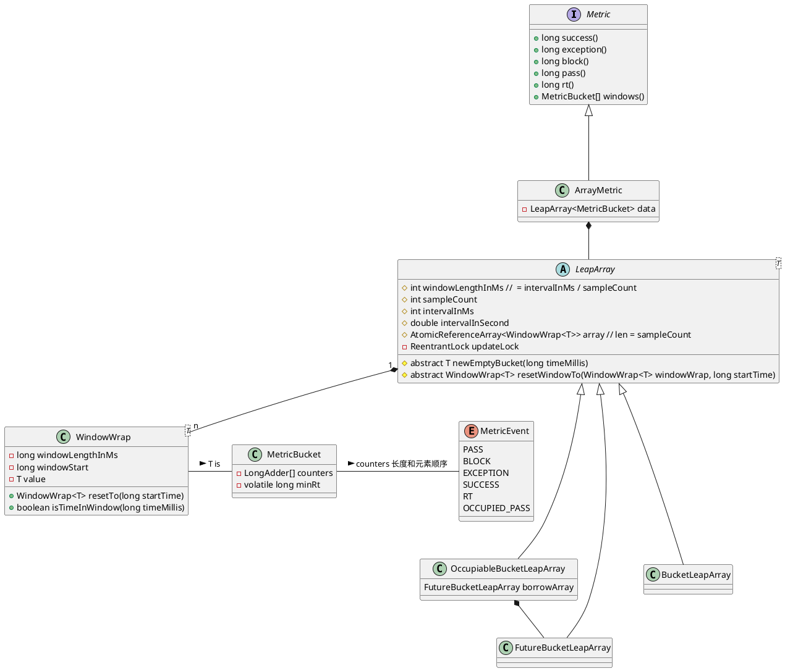
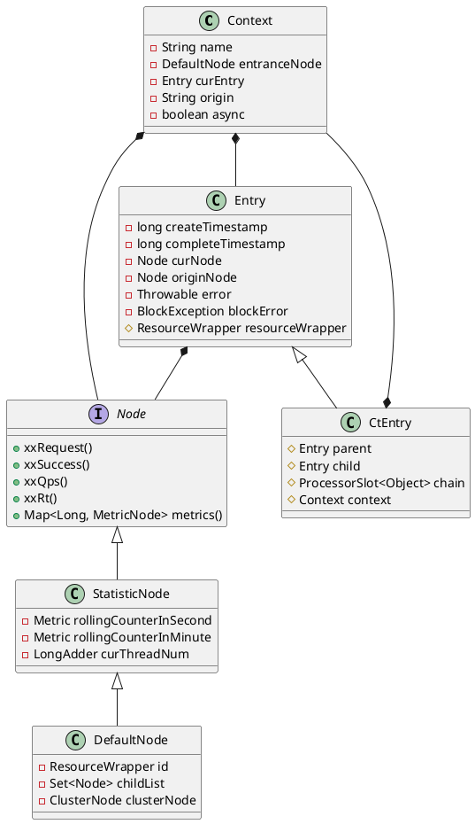
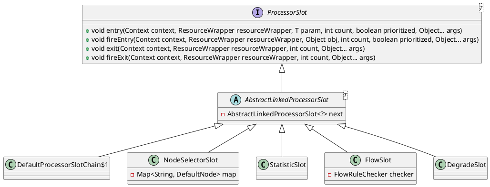
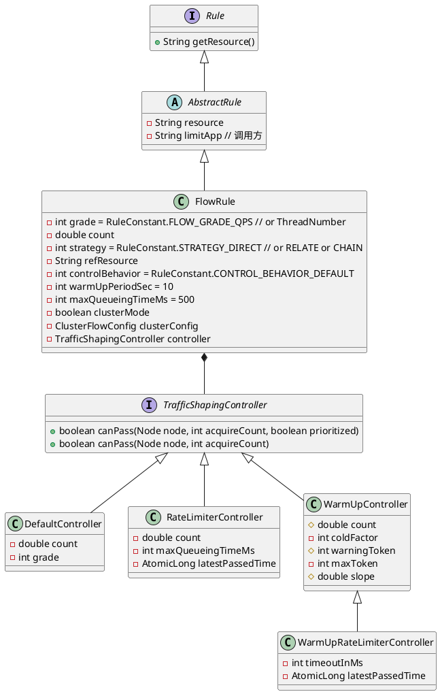
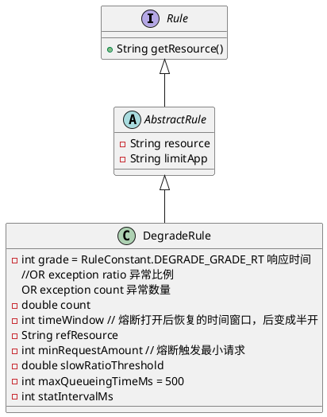
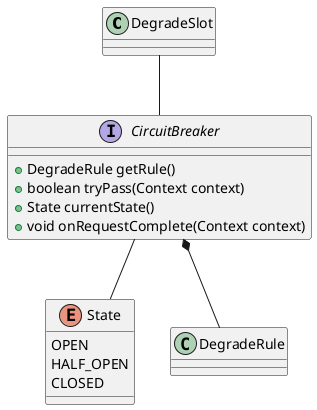

# Sentinel 分析

**Sentinel** 版本 **1.8.0**。

## 滑动窗口

### 核心类







```java
public ArrayMetric(int sampleCount, int intervalInMs) {
    this.data = new OccupiableBucketLeapArray(sampleCount, intervalInMs);
}

public ArrayMetric(int sampleCount, int intervalInMs, boolean enableOccupy) {
    if (enableOccupy) {
        this.data = new OccupiableBucketLeapArray(sampleCount, intervalInMs);
    } else {
        this.data = new BucketLeapArray(sampleCount, intervalInMs);
    }
}
```

统计的项有：

- PASS： 通过；
- BLOCK：阻塞；
- EXCEPTION：异常；
- SUCCESS：成功；
- RT：返回时间；
- OCCUPIED_PASS: 占下一个时间窗口通过 (>= 1.5.0)。

这些按照 `MetricEvent` 中定义的顺序存在 `MetricBucket` 中的 `LongAdder[]`。

> `LongAdder` 是个好东西，**cache line, false sharing**。

`MetricBucket` 存在 `WindowWrap` 中，而 `WindowWrap` 定义了：
- 窗口时间长度；
- 窗口的起始时间。

而 `WindowWrap` 以数组的形式存在于 `LeapArray` 中：

- 所有属性在创建 `LeapArray` 时就已经确定；
- 使用 `AtomicReferenceArray` 来帮助 `MetricBucket` 数组的原子性。

### 当前窗口

`WindowWrap<T> currentWindow(long timeMillis)` 根据当前时间来确定处于哪个时间窗口：
- 如果 `bucket` 缺失，则创建后 **CAS** 到 `data` 中；
- 如果 `bucket` 不缺：
  - 如果 `bucket` 是实时有效的，则直接返回；
  - 如果 `bucket` 是废弃的，则通过 `updateLock` 锁后，重置 `bucket`。


> `AtomicReferenceArray`、`Thread.yield()` 值得注意。这里 `WindowWrap` 数组中的元素是懒加载，创建后就反复使用这些。


## 入口

### SphU::entry

```java
private Entry entryWithPriority(ResourceWrapper resourceWrapper, int count, boolean prioritized, Object... args) throws BlockException {
    // 获取方法调用的上下文环境，在 ThreadLocal 中
    Context context = ContextUtil.getContext();
    if (context instanceof NullContext) {
        return new CtEntry(resourceWrapper, null, context);
    }

    if (context == null) {
        // Using default context.
        context = InternalContextUtil.internalEnter(Constants.CONTEXT_DEFAULT_NAME);
    }

    // 全局开关关闭
    if (!Constants.ON) {
        return new CtEntry(resourceWrapper, null, context);
    }

    // 加载处理链
    ProcessorSlot<Object> chain = lookProcessChain(resourceWrapper);

    if (chain == null) {
        return new CtEntry(resourceWrapper, null, context);
    }

    Entry e = new CtEntry(resourceWrapper, chain, context);
    try {
        chain.entry(context, resourceWrapper, null, count, prioritized, args);
    } catch (BlockException e1) {
        e.exit(count, args);
        throw e1;
    } catch (Throwable e1) {
        RecordLog.info("Sentinel unexpected exception", e1);
    }
    return e;
}
```

比较清晰明了。

```java
ProcessorSlot<Object> lookProcessChain(ResourceWrapper resourceWrapper) {
    // 缓存
    ProcessorSlotChain chain = chainMap.get(resourceWrapper);
    // 双重检测锁
    if (chain == null) {
        synchronized (LOCK) {
            chain = chainMap.get(resourceWrapper);
            if (chain == null) {
                // Entry size limit. 6000
                if (chainMap.size() >= Constants.MAX_SLOT_CHAIN_SIZE) {
                    return null;
                }

                chain = SlotChainProvider.newSlotChain();
                Map<ResourceWrapper, ProcessorSlotChain> newMap = new HashMap<ResourceWrapper, ProcessorSlotChain>(
                    chainMap.size() + 1);
                newMap.putAll(chainMap);
                newMap.put(resourceWrapper, chain);
                chainMap = newMap;
            }
        }
    }
    return chain;
}
```

- 使用了双重检测锁来保证缓存的安全；
- 这里 `ResourceWrapper` 使用了 `name` 来判断相等；
- 使用了 `SPI` 机制，自己加了 `order` 来加载 `SlotChainBuilder` 和 `ProcessorSlot`；
- 使用了**责任链**。

默认提供：
```
# Sentinel default ProcessorSlots
# 构建调用链
com.alibaba.csp.sentinel.slots.nodeselector.NodeSelectorSlot
com.alibaba.csp.sentinel.slots.clusterbuilder.ClusterBuilderSlot
com.alibaba.csp.sentinel.slots.logger.LogSlot
# 实时收集实时消息
com.alibaba.csp.sentinel.slots.statistic.StatisticSlot
com.alibaba.csp.sentinel.slots.block.authority.AuthoritySlot
com.alibaba.csp.sentinel.slots.system.SystemSlot
com.alibaba.csp.sentinel.slots.block.flow.FlowSlot
com.alibaba.csp.sentinel.slots.block.degrade.DegradeSlot
```

### Context

在 `entryWithPriority` 中有初始化 `context` 的代码：

```java
 if (context == null) {
    // Using default context.
    context = InternalContextUtil.internalEnter(Constants.CONTEXT_DEFAULT_NAME);    // sentinel_default_context
 }
```

```java
protected static Context trueEnter(String name, String origin) {
    Context context = contextHolder.get();
    if (context == null) {
        Map<String, DefaultNode> localCacheNameMap = contextNameNodeMap;
        DefaultNode node = localCacheNameMap.get(name);
        if (node == null) {
            if (localCacheNameMap.size() > Constants.MAX_CONTEXT_NAME_SIZE) {
                setNullContext();
                return NULL_CONTEXT;
            } else {
                LOCK.lock();
                try {
                    node = contextNameNodeMap.get(name);
                    if (node == null) {
                        if (contextNameNodeMap.size() > Constants.MAX_CONTEXT_NAME_SIZE) {
                            setNullContext();
                            return NULL_CONTEXT;
                        } else {
                            node = new EntranceNode(new StringResourceWrapper(name, EntryType.IN), null);
                            // Add entrance node.
                            Constants.ROOT.addChild(node);

                            Map<String, DefaultNode> newMap = new HashMap<>(contextNameNodeMap.size() + 1);
                            newMap.putAll(contextNameNodeMap);
                            newMap.put(name, node);
                            contextNameNodeMap = newMap;
                        }
                    }
                } finally {
                    LOCK.unlock();
                }
            }
        }
        context = new Context(node, name);
        context.setOrigin(origin);
        contextHolder.set(context);
    }

    return context;
}
```

- `Context` 生命周期靠 `ThreadLocal`，每个线程会有一个 `Context`；
- `Local cache map` 中存 `EntranceNode`；
- 用双重检测锁；
- 新建的 `EntranceNode` 会加到 `ROOT` 中；

#### 类图





## 调用链

### 类图






- `DefaultProcessorSlotChain$1` 作为 **first** dummy node ？；
- 在上面 `lookProcessChain` 中会为每个 `Resource` 创建一个 `ProcessorSlotChain`；

### NodeSelectorSlot


```java
public void entry(Context context, ResourceWrapper resourceWrapper, Object obj, int count, boolean prioritized, Object... args)
        throws Throwable {

    DefaultNode node = map.get(context.getName());
    if (node == null) {
        synchronized (this) {
            node = map.get(context.getName());
            if (node == null) {
                node = new DefaultNode(resourceWrapper, null);
                HashMap<String, DefaultNode> cacheMap = new HashMap<String, DefaultNode>(map.size());
                cacheMap.putAll(map);
                cacheMap.put(context.getName(), node);
                map = cacheMap;
                // Build invocation tree
                ((DefaultNode) context.getLastNode()).addChild(node);
            }
        }
    }

    context.setCurNode(node);
    fireEntry(context, resourceWrapper, node, count, prioritized, args);
}
```

- 最主要设置 `Context::curEntry::curNode`；
- 创建 `DefaultNode` 到 `EntranceNode` 后。 

### FlowSlot

#### Rule 类图









判断是能够通过，目前只关注本机限制流量：

```java
public boolean canPassCheck(FlowRule rule, Context context, DefaultNode node, int acquireCount, boolean prioritized) {
    String limitApp = rule.getLimitApp();
    // limitApp 默认是 default
    // 如果是 null，则不限制
    if (limitApp == null) {
        return true;
    }

    if (rule.isClusterMode()) {
        return passClusterCheck(rule, context, node, acquireCount, prioritized);
    }

    return passLocalCheck(rule, context, node, acquireCount, prioritized);
}

private static boolean passLocalCheck(FlowRule rule, Context context, DefaultNode node, int acquireCount, boolean prioritized) {
    Node selectedNode = selectNodeByRequesterAndStrategy(rule, context, node);
    if (selectedNode == null) {
        return true;
    }

    return rule.getRater().canPass(selectedNode, acquireCount, prioritized);
}
```

选择节点：
```java
static Node selectNodeByRequesterAndStrategy(/*@NonNull*/ FlowRule rule, Context context, DefaultNode node) {
    // 该条限流规则针对的调用方
    String limitApp = rule.getLimitApp();
    int strategy = rule.getStrategy();
    // 本次请求的调用方，从当前上下文环境中获取
    String origin = context.getOrigin();

    // limitApp != (default || other)
    if (limitApp.equals(origin) && filterOrigin(origin)) {
        if (strategy == RuleConstant.STRATEGY_DIRECT) {
            // Matches limit origin, return origin statistic node.
            return context.getOriginNode();
        }

        return selectReferenceNode(rule, context, node);
    } else if (RuleConstant.LIMIT_APP_DEFAULT.equals(limitApp)) {
        if (strategy == RuleConstant.STRATEGY_DIRECT) {
            // Return the cluster node.
            return node.getClusterNode();
        }

        return selectReferenceNode(rule, context, node);
    } else if (RuleConstant.LIMIT_APP_OTHER.equals(limitApp)
        && FlowRuleManager.isOtherOrigin(origin, rule.getResource())) {
        if (strategy == RuleConstant.STRATEGY_DIRECT) {
            return context.getOriginNode();
        }

        return selectReferenceNode(rule, context, node);
    }

    return null;
}
```

`DefaultController` 快速失败：

```java
public boolean canPass(Node node, int acquireCount, boolean prioritized) {
    // 当前已消耗的令牌数量
    int curCount = avgUsedTokens(node);
    // 请求的令牌数 + 已消耗的令牌数 > 总令牌数
    if (curCount + acquireCount > count) {
        // 存在优先级 && 基于QPS
        if (prioritized && grade == RuleConstant.FLOW_GRADE_QPS) {
            long currentTime;
            long waitInMs;
            currentTime = TimeUtil.currentTimeMillis();
            // 尝试抢占下一个滑动窗口的令牌
            waitInMs = node.tryOccupyNext(currentTime, acquireCount, count);
            if (waitInMs < OccupyTimeoutProperty.getOccupyTimeout()) {
                node.addWaitingRequest(currentTime + waitInMs, acquireCount);
                node.addOccupiedPass(acquireCount);
                sleep(waitInMs);

                // PriorityWaitException indicates that the request will pass after waiting for {@link @waitInMs}.
                throw new PriorityWaitException(waitInMs);
            }
        }
        return false;
    }
    return true;
}
```
### DegradeSlot 降级






有三种模式：
- 平均响应时间；
- 异常比例；
- 异常数量。




