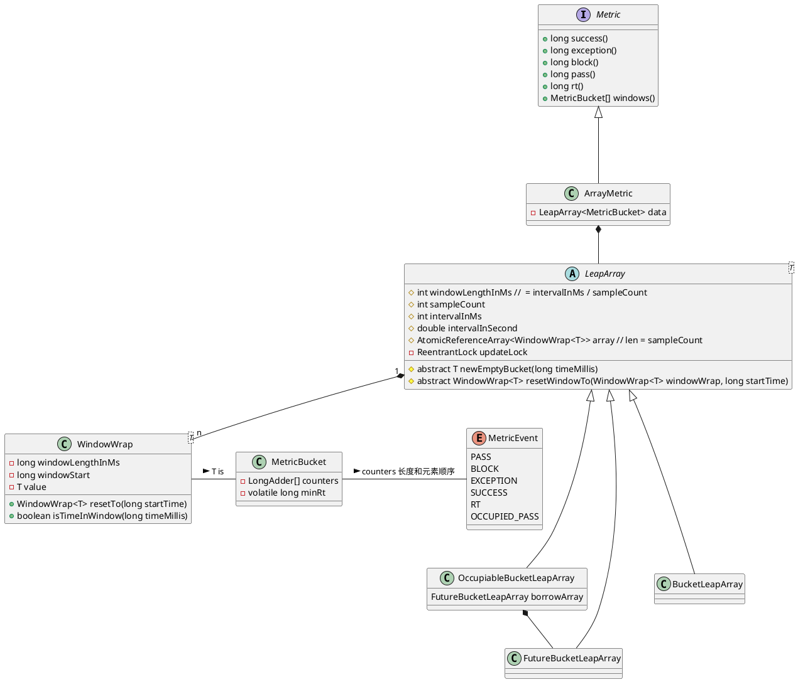

# Sentinel 分析

**Sentinel** 版本 **1.8.0**。

## 滑动窗口

### 核心类







```java
public ArrayMetric(int sampleCount, int intervalInMs) {
    this.data = new OccupiableBucketLeapArray(sampleCount, intervalInMs);
}

public ArrayMetric(int sampleCount, int intervalInMs, boolean enableOccupy) {
    if (enableOccupy) {
        this.data = new OccupiableBucketLeapArray(sampleCount, intervalInMs);
    } else {
        this.data = new BucketLeapArray(sampleCount, intervalInMs);
    }
}
```

统计的项有：

- PASS： 通过；
- BLOCK：阻塞；
- EXCEPTION：异常；
- SUCCESS：成功；
- RT：返回时间；
- OCCUPIED_PASS: 占下一个时间窗口通过 (>= 1.5.0)。

这些按照 `MetricEvent` 中定义的顺序存在 `MetricBucket` 中的 `LongAdder[]`。

> `LongAdder` 是个好东西，**cache line, false sharing**。

`MetricBucket` 存在 `WindowWrap` 中，而 `WindowWrap` 定义了：
- 窗口时间长度；
- 窗口的起始时间。

而 `WindowWrap` 以数组的形式存在于 `LeapArray` 中：

- 所有属性在创建 `LeapArray` 时就已经确定；
- 使用 `AtomicReferenceArray` 来帮助 `MetricBucket` 数组的原子性。

### 当前窗口

`WindowWrap<T> currentWindow(long timeMillis)` 根据当前时间来确定处于哪个时间窗口：
- 如果 `bucket` 缺失，则创建后 **CAS** 到 `data` 中；
- 如果 `bucket` 不缺：
  - 如果 `bucket` 是实时有效的，则直接返回；
  - 如果 `bucket` 是废弃的，则通过 `updateLock` 锁后，重置 `bucket`。


> `AtomicReferenceArray`、`Thread.yield()` 值得注意。这里 `WindowWrap` 数组中的元素是懒加载，创建后就反复使用这些。


## 入口

### SphU::entry

```java
private Entry entryWithPriority(ResourceWrapper resourceWrapper, int count, boolean prioritized, Object... args) throws BlockException {
    // 获取方法调用的上下文环境，在 ThreadLocal 中
    Context context = ContextUtil.getContext();
    if (context instanceof NullContext) {
        return new CtEntry(resourceWrapper, null, context);
    }

    if (context == null) {
        // Using default context.
        context = InternalContextUtil.internalEnter(Constants.CONTEXT_DEFAULT_NAME);
    }

    // 全局开关关闭
    if (!Constants.ON) {
        return new CtEntry(resourceWrapper, null, context);
    }

    // 加载处理链
    ProcessorSlot<Object> chain = lookProcessChain(resourceWrapper);

    if (chain == null) {
        return new CtEntry(resourceWrapper, null, context);
    }

    Entry e = new CtEntry(resourceWrapper, chain, context);
    try {
        chain.entry(context, resourceWrapper, null, count, prioritized, args);
    } catch (BlockException e1) {
        e.exit(count, args);
        throw e1;
    } catch (Throwable e1) {
        RecordLog.info("Sentinel unexpected exception", e1);
    }
    return e;
}
```

比较清晰明了。

```java
ProcessorSlot<Object> lookProcessChain(ResourceWrapper resourceWrapper) {
    // 缓存
    ProcessorSlotChain chain = chainMap.get(resourceWrapper);
    // 双重检测锁
    if (chain == null) {
        synchronized (LOCK) {
            chain = chainMap.get(resourceWrapper);
            if (chain == null) {
                // Entry size limit. 6000
                if (chainMap.size() >= Constants.MAX_SLOT_CHAIN_SIZE) {
                    return null;
                }

                chain = SlotChainProvider.newSlotChain();
                Map<ResourceWrapper, ProcessorSlotChain> newMap = new HashMap<ResourceWrapper, ProcessorSlotChain>(
                    chainMap.size() + 1);
                newMap.putAll(chainMap);
                newMap.put(resourceWrapper, chain);
                chainMap = newMap;
            }
        }
    }
    return chain;
}
```

- 使用了双重检测锁来保证缓存的安全；
- 这里 `ResourceWrapper` 使用了 `name` 来判断相等；
- 使用了 `SPI` 机制，自己加了 `order` 来加载 `SlotChainBuilder` 和 `ProcessorSlot`；
- 使用了**责任链**。

默认提供：
```
# Sentinel default ProcessorSlots
# 构建调用链
com.alibaba.csp.sentinel.slots.nodeselector.NodeSelectorSlot
com.alibaba.csp.sentinel.slots.clusterbuilder.ClusterBuilderSlot
com.alibaba.csp.sentinel.slots.logger.LogSlot
# 实时收集实时消息
com.alibaba.csp.sentinel.slots.statistic.StatisticSlot
com.alibaba.csp.sentinel.slots.block.authority.AuthoritySlot
com.alibaba.csp.sentinel.slots.system.SystemSlot
com.alibaba.csp.sentinel.slots.block.flow.FlowSlot
com.alibaba.csp.sentinel.slots.block.degrade.DegradeSlot
```