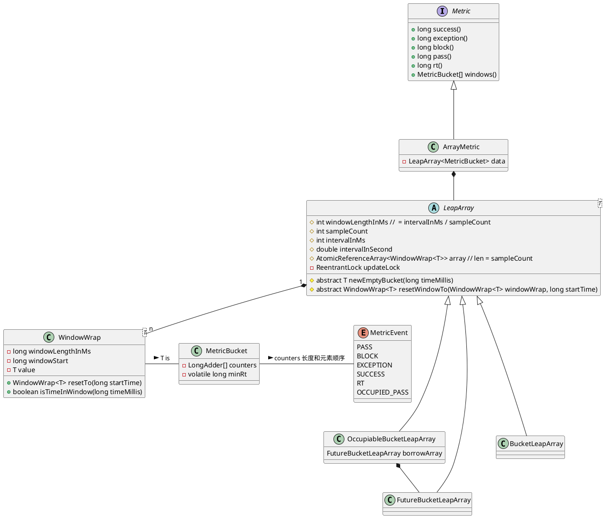

# Sentinel 分析


## 滑动窗口

### 核心类







```java
public ArrayMetric(int sampleCount, int intervalInMs) {
    this.data = new OccupiableBucketLeapArray(sampleCount, intervalInMs);
}

public ArrayMetric(int sampleCount, int intervalInMs, boolean enableOccupy) {
    if (enableOccupy) {
        this.data = new OccupiableBucketLeapArray(sampleCount, intervalInMs);
    } else {
        this.data = new BucketLeapArray(sampleCount, intervalInMs);
    }
}
```

统计的项有：

- PASS： 通过；
- BLOCK：阻塞；
- EXCEPTION：异常；
- SUCCESS：成功；
- RT：返回时间；
- OCCUPIED_PASS: 占下一个时间窗口通过 (>= 1.5.0)。

这些按照 `MetricEvent` 中定义的顺序存在 `MetricBucket` 中的 `LongAdder[]`。

> `LongAdder` 是个好东西，**cache line, false sharing**。

`MetricBucket` 存在 `WindowWrap` 中，而 `WindowWrap` 定义了：
- 窗口时间长度；
- 窗口的起始时间。

而 `WindowWrap` 以数组的形式存在于 `LeapArray` 中：

- 所有属性在创建 `LeapArray` 时就已经确定；
- 使用 `AtomicReferenceArray` 来帮助 `MetricBucket` 数组的原子性。