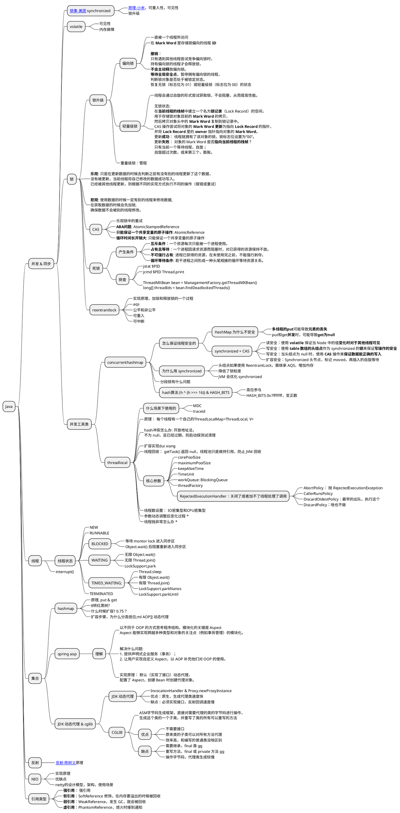
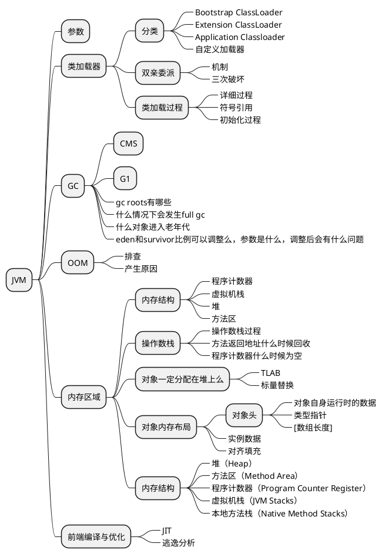
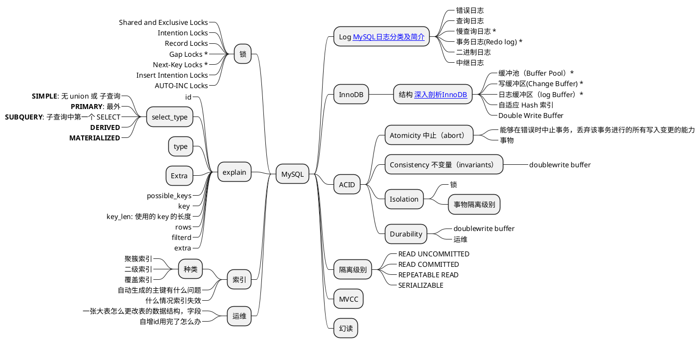
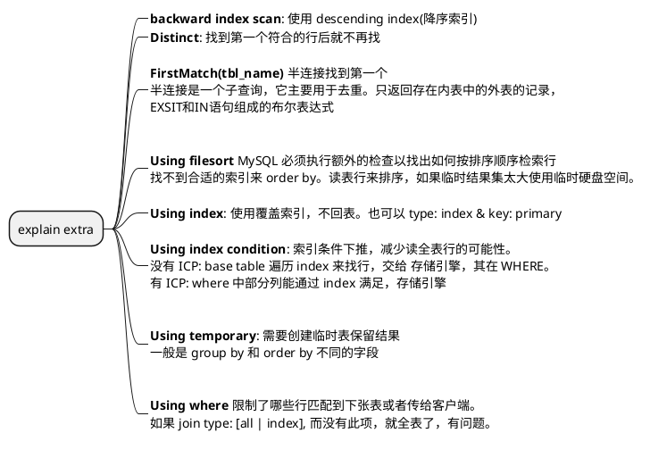
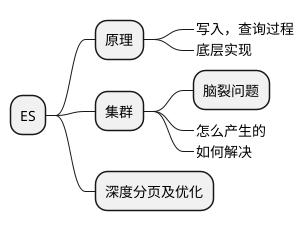
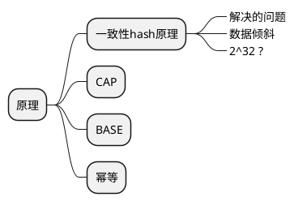
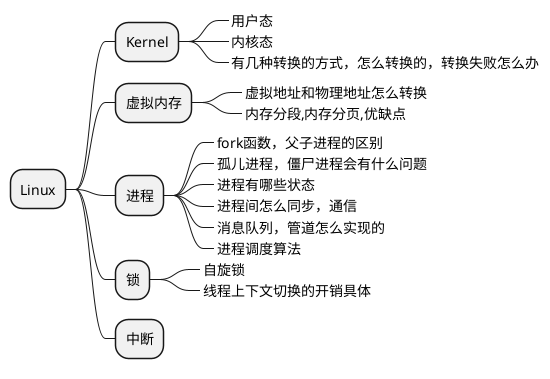
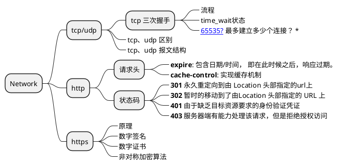
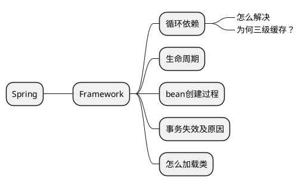

# 查漏补缺

## Java


---

## JVM



---

## MySQL




```plantuml
@startmindmap explain type 脑图
* explain type
**_ **system**: 表只有一行
**_ **const**: 最多一行匹配；主键或者唯一键
**_: 
**eq_ref**:  对于前面的
表中各种组合，此表只取出一行
;
**_:
**ref**: 对于前面的表的各种组合，
此表匹配的索引值
;

**_ **ref_or_null**: 像 ref 但再搜索 NULL 值

**_: 
**index_merge**: key 中反映的是索引
使用的 key 的列表。
一张表的多个 range 扫描合并成一个
合并可能是交集、并集、差集
;
left
**_ **unique_subquery**: in 中的 eq_ref
**_:
**index_subquery**: 类似 unique_subquery
但不是在 unique 索引上
;
**_ **range**: 指定区间中的行被拉取
**_: 
**index**: 连接类型同 all,只是索引树被扫描
覆盖索引满足查询的数据，Extra:  Using index，比 all 快，索引数据小
按照索引顺序进行全表查询，Extra 中没有
;
**_ **ALL**: 对先前表中的每个行组合进行全表扫描。非常不好，加索引
@endmindmap
```




---

## Redis

```plantuml
@startmindmap
* Redis
** 数据结构

*** Hash
**** 数据结构
*****_ ziplist
*****_:
哈希表
typedef struct dictht {
    // 哈希表数组
    dictEntry **table
    // 哈希表大小
    unsigned long size
    // 哈希表大小掩码，用于计算索引值
    // 总是等于 size - 1
    unsigned long sizemask
    // 该哈希表已有节点的数量
    unsigned long used

} dictht
;
*****_:
哈希表节点
typedef struct dictEntry {
    // 键
    void *key
    // 值
    union {
        void *val
        uint64_t u64
        int64_t s64
    } v
    // 指向下个哈希表节点，形成链表
    struct dictEntry *next

} dictEntry
;
*****_:
字典
typedef struct dict {
    // 类型特定函数
    dictType *type
    // 私有数据
    void *privdata
    // 哈希表 ht[1]只在 rehash 使用
    dictht ht[2]
    // rehash 索引
    // 当 rehash 不在进行时，值为 -1
    int rehashidx; /* rehashing not in progress if rehashidx == -1 */
} dict
;
**** 负载因子
*****_ 没有 BG ht[0].used / ht[0].size > 1
*****_ 有 BG ht[0].used / ht[0].size > 5
*****_ BG 会启动子进程，copy-on-write，提高效率，提高负载因子，避免 re
*****_ ht[0].used / ht[0].size < 0.1 收缩 
**** rehash
*****_ 1. 为 ht[1] 分配空间， 让字典同时持有 ht[0] 和 ht[1] 两个哈希表
*****_ 2. rehashidx = 0，表示开始
*****_ 3. 开始对桶内元素 rehash，完成后 hashidx++，表示下个桶位置
*****_ 4. ht[0] 所有的 rehash 完，hashidx = -1

*** Set
****_ 无序的 string 集合
**** 数据结构
*****_: 
typedef struct **intset** {
    // 保存元素所使用的类型的长度
    uint32_t encoding
    // 元素个数
    uint32_t length
    // 保存元素的数组
    int8_t contents[]
} intset
;
*****_ hashset

*** Sorted Set
****_ skiplist
****_ ziplist
****_ 用途

*** String
****_ int
****_ long
****_: 
raw(embstr < 39b **SDS**)

struct **sdshdr** { // 字符串长度 
    int len // buf数组中未使用的字节数 
    int free // 字节数组，用于保存字符串 
    char buf[] 
}
;
**** 特点
*****_ 常数复杂度获取字符串长度，内置了长度
*****_ 杜绝缓冲区溢出，空间分配测测策略
*****_:
减少修改字符串时带来的内存重分配次数
< 1Mb --> *2
>= 1Mb --> +1Mb
free 记录未使用的空间，需要时删除
;
*****_ 二进制安全
*****_ 最大 512Mb


*** hyperloglog
**** 优缺点
*****_ 概率数据结构统计唯一的事物
*****_ < 1% 的误差
*****_ 最多用 12k
*****_ 技术上是不同的数据结构，但是编码成 string


*** List
**** 数据结构
*****_: **节点**
typedef structlis tNode{ 
    struct listNode* prev // 前置节点 
    struct listNode* next // 后置节点 
    void* value // 节点值 可放任何节点 
} listNode
;
*****_: **链表**
typedef struct list {  
    listNode *head // 表头节点
    listNode *tail // 表尾节点
    unsigned long len // 链表包含的节点数量
    void* (*dup)(void* ptr) // 节点复制函数
    void (*free)(void* ptr) // 节点释放函数
    int (*match)(void* ptr, void* key) // 节点对比函数
} list
;
*****_ ziplist 节约内存
**** 使用场景
*****_ 社交网络最后更新的 post
*****_ 进程间交互生产者-消费者
**** 特点
*****_ 上限 list，LTRIM
*****_ 阻塞操作 B{L|R}{PUSH|POP}
*****_ 循环列表，可靠队列 LMOVE

*** bitmap
****_ 数据结构并不真实存在，string
****_ 最大 512M， 2^32
**** 用途
*****_ 各种实时分析
*****_ 存储与对象 id 相关的空间高效的高性能的 bool 信息



** 集群
*** cluster
****_ 16384 slot?
**** 原理

*** sentinel
****_ 选举过程
****_ 脑裂
****_ raft?

***_ 如何扩容
***_ 各个节点间怎么通信的

** 可用性
***_ 与数据库一致性
***_ 缓存雪崩 多 key 集体失效
***_ 缓存击穿 单热点 key 失效，
***_ 缓存穿透，猛攻 key 不存在，布隆过滤器
***_ 怎么保证redis和mysql的一致性

** 分布式锁
***_ 实现方法
***_ 过期时间的制定
***_ 续锁
***_ RedLock

** 线程模型
***_ epoll
***_ 单线程的优缺点
***_ 什么情况下会出现阻塞，怎么解决

** 持久化
*** AOF
****_ 阻塞？
****_ 什么时候使用
*** RDB
***_ 用处
****_ 什么时候使用

** 管道
***_ 用处
***_ 原理
***_ 原子性？
***_ 和事务的区别？

@endmindmap
```


---
## ES



---
## 分布式



---
## Linux


---

## 网络



### TCP 最多可建立多少个连接？
```
fs.file-max： 当前系统可打开的最大数量
fs.nr_open： 当前系统单个进程可打开的最大数量
nofile： 每个用户的进程可打开的最大数量
```

linux 下一切皆文件，包括 socket。所以每当进程打开一个 socket 时候，内核实际上都会创建包括 file 在内的几个内核对象。该进程如果打开了两个 socket，那么它的内核对象结构如下图。


---

## Spring



