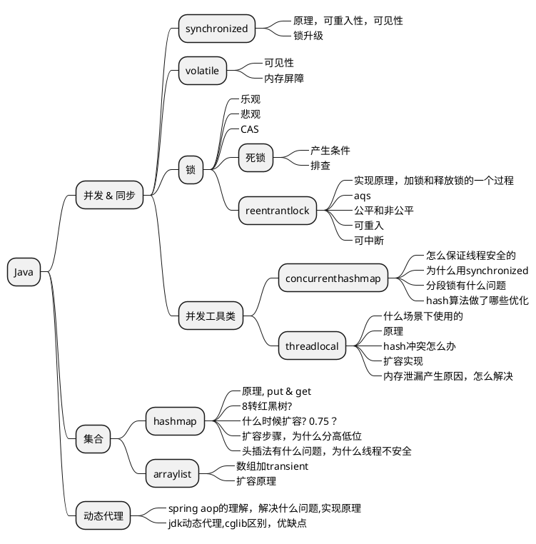
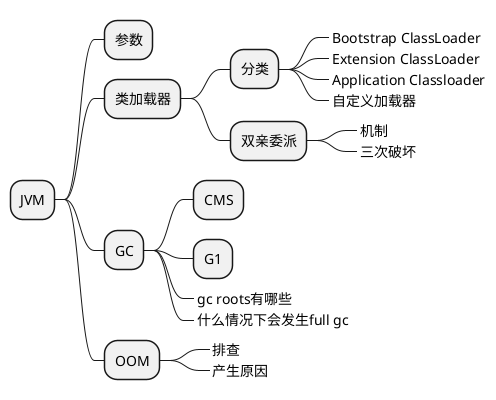
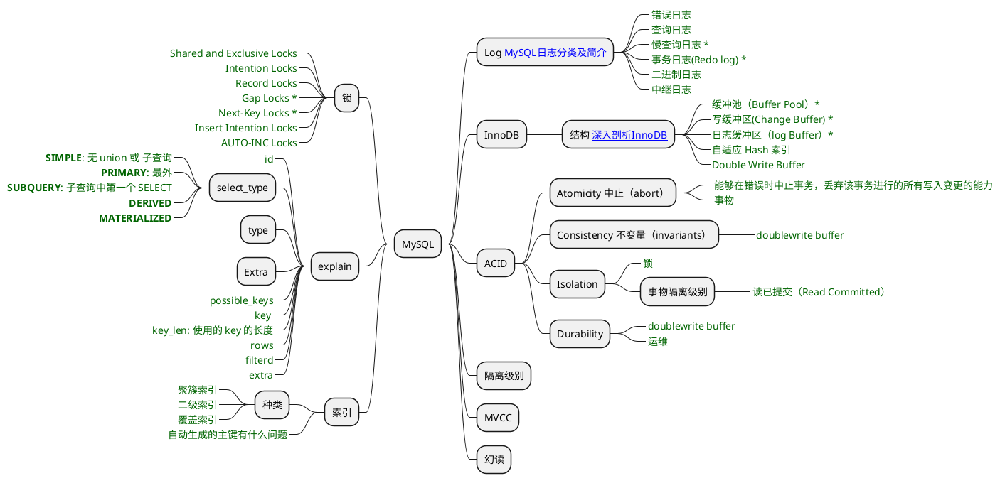
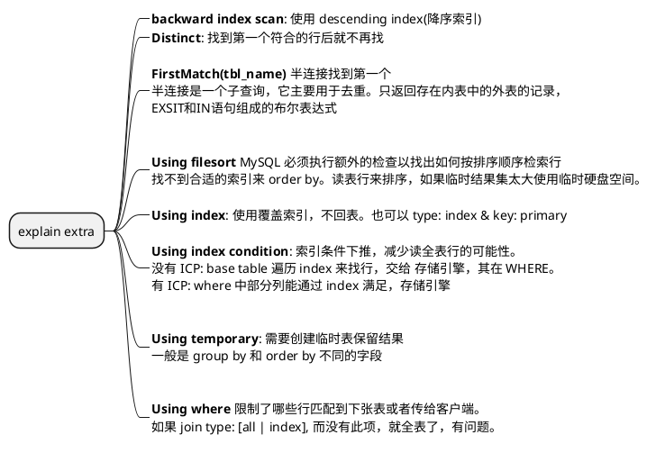
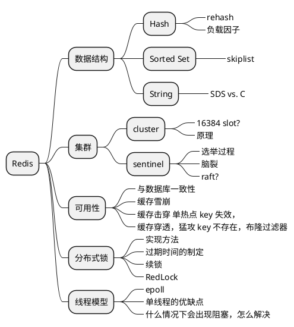
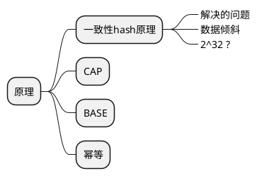

# 查漏补缺

## Java


## JVM



## MySQL




```plantuml
@startmindmap explain type 脑图
* explain type
**_ **system**: 表只有一行
**_ **const**: 最多一行匹配；主键或者唯一键
**_: 
**eq_ref**:  对于前面的
表中各种组合，此表只取出一行
;
**_:
**ref**: 对于前面的表的各种组合，
此表匹配的索引值
;

**_ **ref_or_null**: 像 ref 但再搜索 NULL 值

**_: 
**index_merge**: key 中反映的是索引
使用的 key 的列表。
一张表的多个 range 扫描合并成一个
合并可能是交集、并集、差集
;
left
**_ **unique_subquery**: in 中的 eq_ref
**_:
**index_subquery**: 类似 unique_subquery
但不是在 unique 索引上
;
**_ **range**: 指定区间中的行被拉取
**_: 
**index**: 连接类型同 all,只是索引树被扫描
覆盖索引满足查询的数据，Extra:  Using index，比 all 快，索引数据小
按照索引顺序进行全表查询，Extra 中没有
;
**_ **ALL**: 对先前表中的每个行组合进行全表扫描。非常不好，加索引
@endmindmap
```



## Redis



## 分布式

