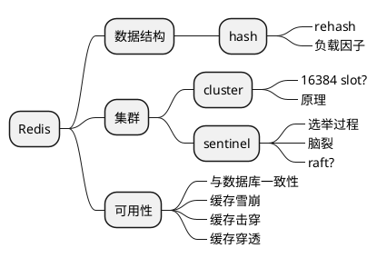

# 查漏补缺

## Redis

```plantuml
@startmindmap
* Redis
** 数据结构
*** hash
****_ rehash
****_ 负载因子


** 集群
*** cluster
****_ 16384 slot?
****_ 原理

*** sentinel
****_ 选举过程
****_ 脑裂
****_ raft?

** 可用性
***_ 与数据库一致性
***_ 缓存雪崩
***_ 缓存击穿
***_ 缓存穿透

@endmindmap
```
