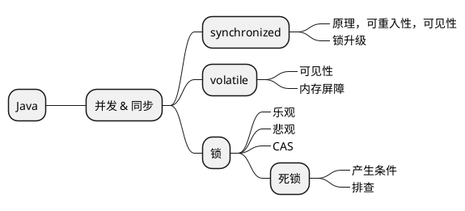
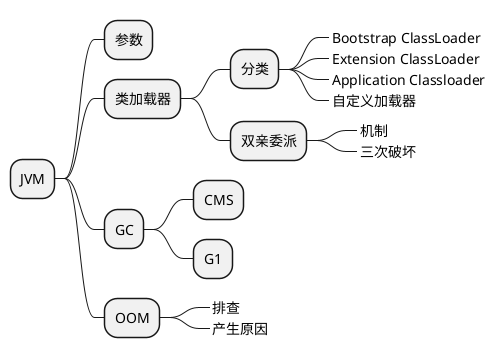
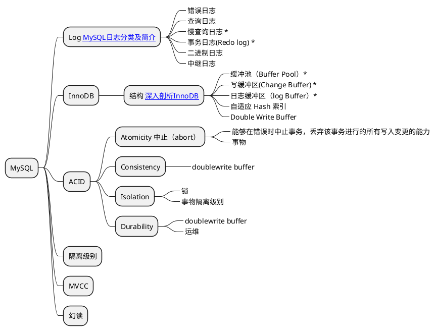
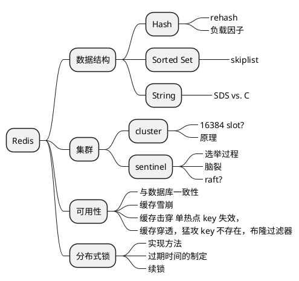

# 查漏补缺

## Java

```plantuml
@startmindmap
* Java

** 并发 & 同步

*** synchronized
****_ 原理，可重入性，可见性
****_ 锁升级

*** volatile
****_ 可见性
****_ 内存屏障

*** 锁
****_ 乐观
****_ 悲观
****_ CAS
**** 死锁
*****_ 产生条件
*****_ 排查

@endmindmap
```

## JVM

```plantuml
@startmindmap
* JVM

** 参数

** 类加载器
*** 分类
****_ Bootstrap ClassLoader
****_  Extension ClassLoader
****_ Application Classloader
****_ 自定义加载器
*** 双亲委派
****_ 机制
****_ 三次破坏

** GC
*** CMS
*** G1

** OOM
***_ 排查
***_ 产生原因
@endmindmap
```

## MySQL

```plantuml
@startmindmap
* MySQL

** Log [[https://zhuanlan.zhihu.com/p/58011817 MySQL日志分类及简介]]
***_ 错误日志
***_ 查询日志
***_ 慢查询日志 *
***_ 事务日志(Redo log) *
***_ 二进制日志
***_ 中继日志

** InnoDB
*** 结构 [[https://zhuanlan.zhihu.com/p/235458760 深入剖析InnoDB]]
****_ 缓冲池（Buffer Pool）*
****_ 写缓冲区(Change Buffer) *
****_ 日志缓冲区（log Buffer）*
****_ 自适应 Hash 索引
****_ Double Write Buffer

** ACID
*** Atomicity 中止（abort）
****_ 能够在错误时中止事务，丢弃该事务进行的所有写入变更的能力
****_ 事物
*** Consistency
****_ doublewrite buffer
*** Isolation
****_ 锁
****_ 事物隔离级别
*** Durability
****_ doublewrite buffer
****_ 运维

** 隔离级别
** MVCC
** 幻读
@endmindmap
```

## Redis

```plantuml
@startmindmap
* Redis
** 数据结构
*** Hash
****_ rehash
****_ 负载因子
*** Sorted Set
****_ skiplist
*** String
****_ SDS vs. C


** 集群
*** cluster
****_ 16384 slot?
****_ 原理

*** sentinel
****_ 选举过程
****_ 脑裂
****_ raft?

** 可用性
***_ 与数据库一致性
***_ 缓存雪崩
***_ 缓存击穿 单热点 key 失效，
***_ 缓存穿透，猛攻 key 不存在，布隆过滤器

** 分布式锁
***_ 实现方法
***_ 过期时间的制定
***_ 续锁

@endmindmap
```